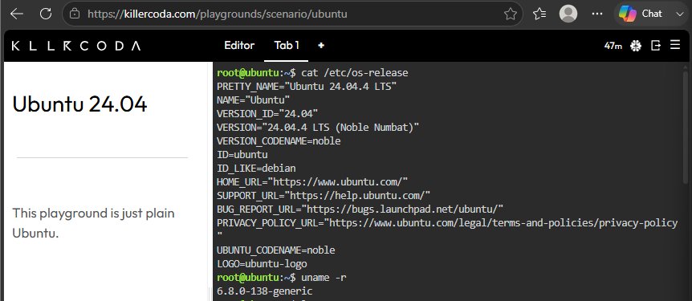
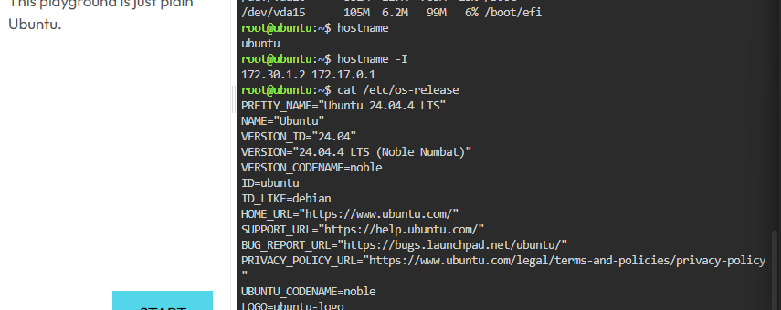
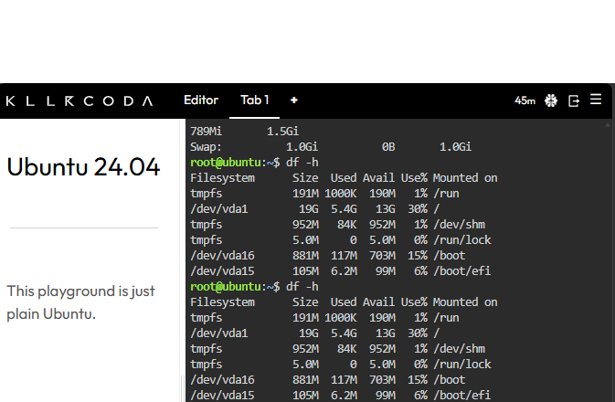

# Infrastructure Assessment Report

## Environment Details
- **Operating System:** Ubuntu 22.04.4 LTS
- **Kernel Version:** 6.8.0-138-generic
- **CPU Model:** Intel Xeon E312xx(Sandy Bridge, IBRS update)
- **Number of CPU Cores:** 1 Core
- **Total RAM:** 4.0 GB
- **Disk Capacity:** 19 GB
- **Mounted File Systems:** `/dev/vda1` mounted on `/`
- **Hostname:** Ubuntu
- **IP Address:** 172.30.1.2 172.17.0.1

## System Screenshots

